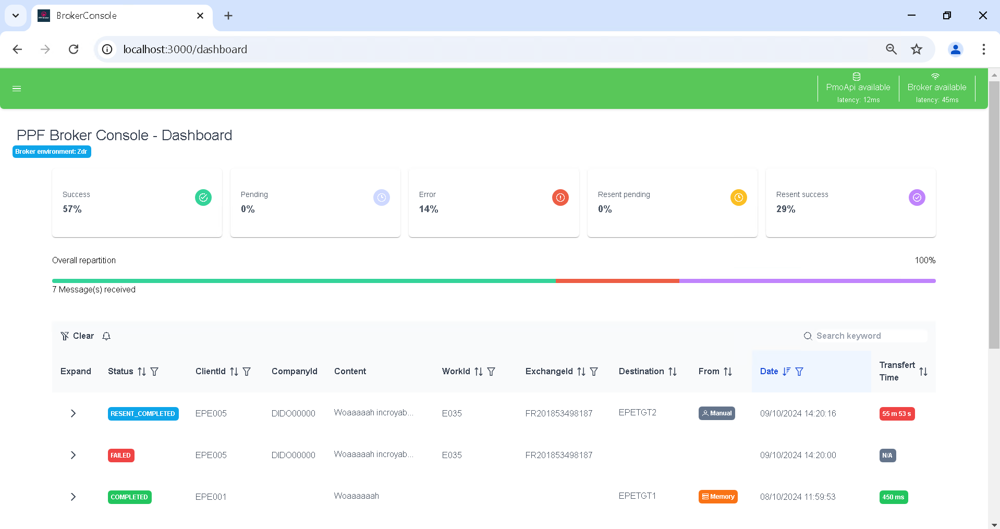
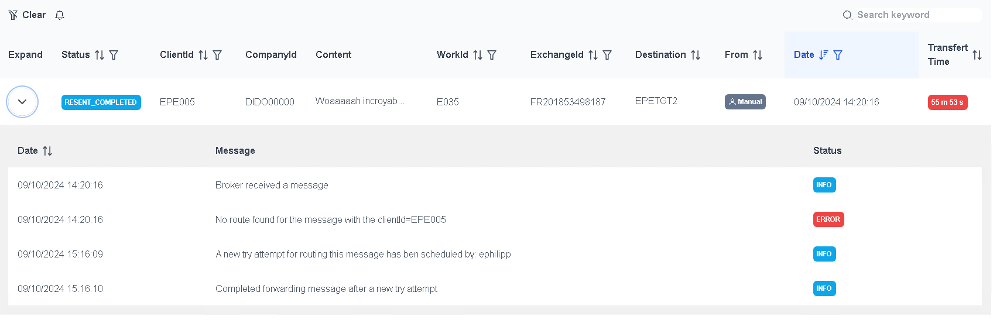
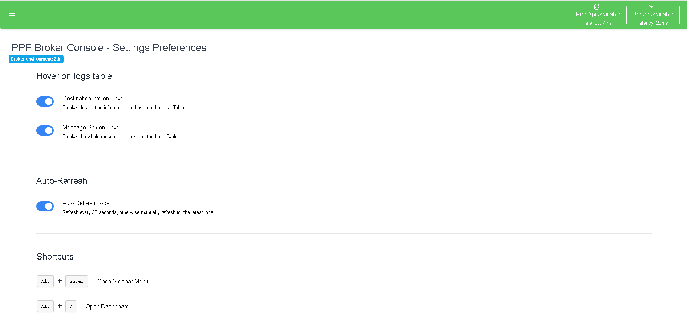

# Broker

This project is a MqMessage broker and its console that can be used to send and receive messages between different services.



## Getting Started

### Prerequisites

| Name | Version  |
|------|----------|
| Java | 21       |
| Maven| \>=3.6.x |

### Install Java

#### Windows

1. Download the latest version of Java from the [official website](https://www.oracle.com/java/technologies/javase-jdk11-downloads.html).
2. Run the installer.
3. Set the JAVA_HOME environment variable to the path where Java is installed.
4. Add the Java bin directory to the PATH environment variable.
5. Open a new terminal and run `java -version` to verify the installation.

#### Linux

1. Open a terminal.
2. Run `sudo apt update`.
3. Run `sudo apt install openjdk-11-jdk`.
4. Run `java -version` to verify the installation.

### Installation

1. Clone the repository.
2. Open a terminal.
3. Navigate to the project directory.
4. Run `mvn clean install`.
5. Run `mvn spring-boot:run`.
6. The broker will start running on `localhost`.

## Development

The core application is a Spring Boot application, allowing to serve HTTP requests.

### Broker.java

This class is the main engine of the broker. It is responsible for handling the messages and the connections between the services.
You'll be able to find all the methods that are necessary to handle the messages, reroute them, and send them to the correct service.

### resolver/

This package contains the classes that are responsible for resolving the messages and the services. The `Resolver` class aggregates all the resolvers and is responsible for calling the correct resolver for the message when one of them is down.
The resolver rank the resolvers by this rank:
1. `ApiRoutes` - This resolver is responsible for handling the messages that are sent to another API having the most recent data.
2. `Memory` - If the `ApiRoutes` resolver is down, the `Resolver` singleton will use its own memory to resolve the message
3. `File` - If the `Memory` resolver is empty (can only happen at start), the `Resolver` singleton will use the json cache file to resolve the message

> The broker has a cooldown of 1 hour, where if the `ApiRoutes` is used, the File cache will be updated with the new data. So in theory the `File` resolver will always have the most recent data at 1 hour of delay maximum.

--- 

The `Resolver` gives its own `Answer` object that contains the destination, all the destination properties (Q, QM, Protocol, Host, Port) and also the source of the resolution. Check `resolver/answer/` package for further information.

### logs/

The second main job of the Broker is to be able to log everything that is happening, and also being able to normalize all the message written to be able to re-read them later. 

Based on `log4j2`, `BrokerLogger` gives all the necessary tools to log the whole life cycle of message going through the broker.

`BrokerRoutingStatus`, `BorkerLogsStatus` and `BrokerLogsMessages` provides static ressources in order to be able to write in a consistent way with the final aim to read them and categorize them further than just `INFO`, `ERROR` or `DEBUG`.

Logs are stored in two different location, one as `app` logs  and `system` logs. 
In `logs/app/` directory, you'll find all the human-readable logs that could be easily read in instances of errors or debug.
In `logs/system/` directory, you'll find all the logs that are written in a normalized way, in order to be able to re-read them later way easier.

> You can find all the patterns in the `ressources/log4j2.xml` file.

#### logs/routing/

This package provides all the necessary to read, parse and represent the logs read in the `logs/system/routing.log` directory.
This file contains the **whole** life-cycle of the messages that went through the broker.

#### logs/mqfile

The `logs/system/mqfile.log` is a sort of *database* that links the messages to the library dump files
This package provides also all the necessary to read, parse and represent the logs read in the `logs/system/mqfile.log` directory.

### controller/

This package contains the classes that are responsible for handling the HTTP requests.

`AppController.java` aims to handle the requests that gravitate around the Broker application itself like the status of the broker and its services.

`PropertiesController.java` aims to handle the requests that gravitate around the properties of the broker cf. `ressources/application.properties` etc.

`LogsController.java` gives all the necessary tools to read the logs that are read thanks to the (Logs Routing)[#logs-routing] package. It also provides the post method to reroute failed messages.

### config/

In the `config/` package, you'll find the `BeanConfig.java` class that is responsible for creating the beans that are necessary for the broker to run and also the `Config.java` that provides methods to easily access environment variables

---

# BrokerConsole

This project is the console for the Broker project. It is a web application that allows the user to manage the Broker behavior and to monitor the Broker's activity.

## Table of Contents

- [Broker](#broker)
  - [Getting Started](#getting-started)
    - [Prerequisites](#prerequisites)
    - [Install Java](#install-java)
      - [Windows](#windows)
      - [Linux](#linux)
    - [Installation](#installation)
  - [Development](#development)
    - [Broker.java](#brokerjava)
    - [resolver/](#resolver)
    - [logs/](#logs)
      - [logs/routing/](#logsrouting)
      - [logs/mqfile](#logsmqfile)
    - [controller/](#controller)
    - [config/](#config)
- [BrokerConsole](#brokerconsole)
  - [Table of Contents](#table-of-contents)
  - [Requirements](#requirements)
    - [Install Node.js](#install-nodejs)
      - [Information](#information)
      - [Windows](#windows-1)
      - [Linux](#linux-1)
    - [Install Angular CLI](#install-angular-cli)
  - [Installation and Build](#installation-and-build)
    - [Manual](#manual)
      - [Server](#server)
        - [Install](#install)
        - [Build](#build)
      - [Angular Client](#angular-client)
        - [Install](#install-1)
        - [Build](#build-1)
    - [Automatic (Linux only)](#automatic-linux-only)
  - [Environment variables](#environment-variables)
    - [Server](#server-1)
    - [Angular Client](#angular-client-1)
  - [Development environment](#development-environment)
    - [Angular Client](#angular-client-2)
    - [Code scaffolding](#code-scaffolding)
    - [Server](#server-2)
  - [Production environment](#production-environment)
    - [Angular Client](#angular-client-3)
    - [Server](#server-3)

## Requirements

| Requirement | Version    |
| ----------- | ---------- |
| Node.js     | >= 20.12.2 |
| Angular CLI | >= 18.2.5  |
| Python      | >= 2.x.x   |

> Python is required for the `bcrypt` package for password hashing.

### Install Node.js

#### Information

> The project is cut into two parts, the server and the Angular client. The server is written with Typescript for NodeServer and the Angular client is written in Typescript for Browser with Angular (that's why they cant be in the same package.json).

> The angular project, after building won't need all its dependencies (frontend/node_modules) to run, but the server will need all its dependencies (server/node_modules) to run and can't be served using only the `server/dist/` directory only.

#### Windows

1. Download the Windows installer from the [Nodes.js® web site](https://nodejs.org/en/download/).
2. Run the installer (the .msi file you downloaded in the previous step.)
3. Follow the prompts in the installer (Accept the license agreement, click the NEXT button a bunch of times and accept the default installation settings).
4. Restart your computer. You won’t be able to run Node.js until you restart your computer.

#### Linux

1. Open a terminal window.

2. Install Node Version Manager (NVM) with the following command:

```bash
curl -o- https://raw.githubusercontent.com/nvm-sh/nvm/v0.38.0/install.sh | bash
```

3. Close the terminal window and open a new one.

4. Install Node.js with the following command:

```bash
nvm install node
```

### Install Angular CLI

1. Open a terminal window.

2. Install Angular CLI with the following command:

```bash
npm install -g @angular/cli
```

## Installation and Build

### Manual

#### Server

##### Install

Go to the `server/` directory and run `npm install` to install the required packages.

##### Build

Run `npm run build` to build the project. The build artifacts will be stored in the `dist/` directory.

#### Angular Client

##### Install

Go to the `frontend/` directory and run `npm install` to install the required packages.

##### Build

Run `ng build` to build the project. The build artifacts will be stored **automatically** in the `server/public/` directory, ready to be served by either the dev server (src/) or the production server (dist/).

### Automatic (Linux only)

Run the `install.sh` script to install the required packages for the server and Angular client, it will also build the Angular client and the server.

```bash
./install.sh
```

---

## Environment variables

The server uses environment variables to configure the application. The following variables are required:

### Server

`server/.env`

```env
PORT=3000

PASSWORD=<your_hashed_password>
```

> The password must be hashed with bcrypt. the `server/src/server.ts` file provides a function to hash a password.

```typescript

...

const generatePassword = function (pass: string) {
  return bcryptjs.hashSync(pass, bcryptjs.genSaltSync(10));
};

console.log(generatePassword('your_super_secret_password'));

```

> The password is shared with all the users and is used to authenticate the users.

### Angular Client

`frontend/src/conf/env.ts`

```typescript
const FIVE_MINUTES = 1000 * 60 * 5;
const THIRTY_MINUTES = 1000 * 60 * 30;

export const BROKER_API = "http://localhost:80";
export const REFRESH_TIME = 1000 * 30;
export const TRANSFERT_TIME_LEVELS = [FIVE_MINUTES, THIRTY_MINUTES];
export const RECENT_THRESHOLD = 1000 * 60 * 60 * 24 * 7 * 3; // 3 weeks

export const BROKER_ENV = "Zdr";
export const BROKER_VERSION = "2.0.0";

const ENV = {
  BROKER_API,
  REFRESH_TIME,
  TRANSFERT_TIME_LEVELS,
  RECENT_THRESHOLD,
};

export default ENV;
```

> WARNING - In order to take effect in production, the Angular client must be rebuilt.

---

## Development environment

### Angular Client

Go to the `frontend/` directory and run `ng serve` for a dev server. Navigate to `http://localhost:4200/`. The application will automatically reload if you change any of the source files.





### Code scaffolding

Run `ng generate component component-name` to generate a new component. You can also use `ng generate directive|pipe|service|class|guard|interface|enum|module`.

### Server

Run `npm run dev` to start the server in development mode. The server will automatically restart if you change any of the source files.

## Production environment

Please read first the [Environment variables](#environment-variables) section and the [Installation and Build](#installation-and-build) section.

> The two parts of the project must be built before being deployed. You can already find the latest project build in the `server/dist/` directory.

### Angular Client

In the `frontend/` directory, run `ng build` to build the project. The build artifacts will be stored in the `server/public/` directory.

### Server

In the `server/` directory, run `npm start` to start the server. The server will be available on `localhost`.
